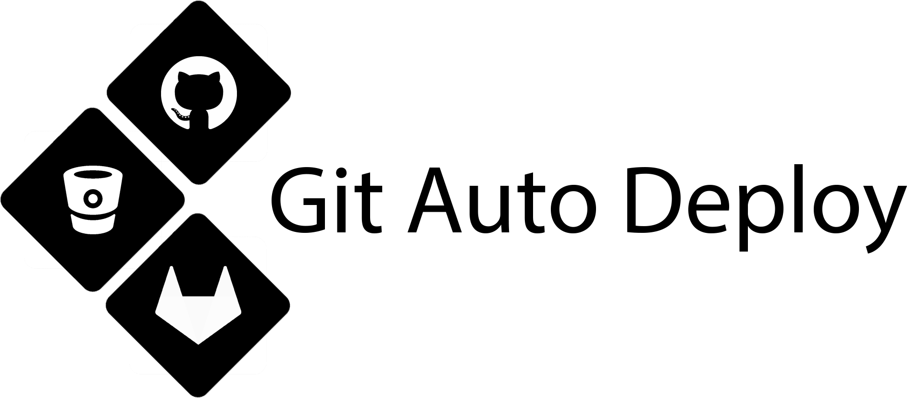

# Git Auto Deployer 🚀
Deploy your code like a Pro! Automate Code Delivery via Git! 😎

## Features
- Auto Commit
- Auto Comment (Changed filenames)
- Auto add updated files
- No need to type git credentials everytime. (Auto save)

## 1. What is Scratch mode?
- If you're starting or creating a new repo then start with Scratch mode. Create a new repo from Github & run the script.

## 2. What is Working mode?
- If you're already working on a repo, then use Working mode. Copy your Repo & run the script.

## Real World Scenario
- Focus on Writing Quality Code & Stop wasting your time typing the same Git Commands/Credentials again & again.

## Installation
1. Clone or Download this Repo.
2. Run git_setup.sh.
3. Now, whenever you modify your code, run git.sh. As easy as that ;)
- *Keep git.sh & git_setup.sh in your project folder*

## How to run?
1. sudo chmod 777 git.sh git_setup.sh
2. ./git_setup.sh or ./git.sh

## Requirements
- Git 
- Works on Linux, Windows

## Note
- If your repository is not empty then run Git_pull.sh
- Your Git Credentials are saved automatically for faster deployment.
- This script uploads your code by default to the *Master* branch.
- You must have a repositery hosted at Github, Gitlab, etc.

Image Credit: Google
